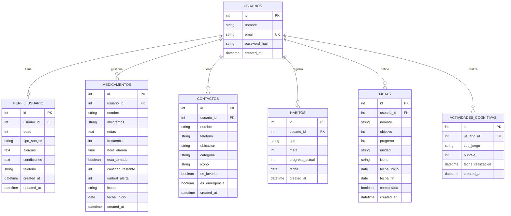

# 📋 Documentación Técnica — Envejecer con Bienestar

> Documento generado el 20/08/2026. Cubre la versión original en .NET MAUI y la migración en curso a Flutter.

---

## 1. 🏗️ ARQUITECTURA DE SOFTWARE

### 1.1 Versión Original — .NET MAUI (MVVM)

La aplicación original fue construida con **.NET MAUI** utilizando el patrón **MVVM (Model-View-ViewModel)**, apoyado en el paquete **CommunityToolkit.Mvvm** para la generación automática de código reactivo.

#### Capas de la Arquitectura

```
EnvejecerConBienestar (.NET MAUI)
│
├── Models/                    ← CAPA MODELO (M)
│   ├── IEntity.cs             ← Contrato base (interface con Id: int)
│   ├── PerfilUsuario.cs       ← Perfil del usuario adulto mayor
│   ├── Medicamento.cs         ← Medicamentos con alarmas
│   ├── Contacto.cs            ← Contactos de emergencia/favoritos
│   ├── Habito.cs              ← Hábitos diarios (agua, caminata, ejercicio)
│   ├── Meta.cs                ← Metas de bienestar personalizadas
│   ├── ActividadCognitiva.cs  ← Registro de puntajes de juegos
│   └── JuegoFicha.cs          ← Modelo UI para juego de memoria (no persiste)
│
├── ViewModels/                ← CAPA VIEWMODEL (VM)
│   ├── HomeViewModel.cs       ← Hábitos, metas del día, próxima medicina, SOS
│   ├── MedicamentosViewModel.cs  ← CRUD medicamentos + toggle tomado
│   ├── MedicamentoDetailViewModel.cs ← Detalle individual de medicamento
│   ├── ContactosViewModel.cs  ← CRUD contactos
│   ├── ContactoDetailViewModel.cs ← Detalle individual de contacto
│   ├── JuegosViewModel.cs     ← Menú de juegos cognitivos
│   └── PerfilViewModel.cs     ← Lectura del perfil de usuario
│
├── Views/                     ← CAPA VIEW (V)
│   ├── HomePage.xaml          ← Pantalla principal
│   ├── MedicamentosPage.xaml  ← Lista de medicamentos
│   ├── MedicamentoDetailPage.xaml
│   ├── ContactosPage.xaml     ← Lista de contactos
│   ├── ContactoDetailPage.xaml
│   ├── JuegosPage.xaml        ← Menú de juegos
│   ├── BuscarParesPage.xaml   ← Juego: Buscar pares (memoria)
│   ├── TriviaPage.xaml        ← Juego: Trivia
│   ├── SopaLetrasPage.xaml    ← Juego: Sopa de letras
│   ├── OrdenarSecuenciaPage.xaml  ← Juego: Ordenar secuencia
│   ├── PerfilPage.xaml        ← Pantalla de perfil
│   └── Popups/                ← Modales (AddMedicamento, AddContacto, AddMeta, Bienvenida)
│
├── Services/                  ← SERVICIOS DE INFRAESTRUCTURA
│   ├── DatabaseService.cs     ← Acceso a SQLite (operaciones CRUD genéricas)
│   ├── AlarmService.cs        ← Gestión de notificaciones locales
│   ├── ContactService.cs      ← Marcación telefónica nativa
│   ├── ReportService.cs       ← Generación de reportes PDF
│   └── IDataService.cs        ← Contrato de servicio de datos
│
└── Helpers/
    ├── DatabaseConstants.cs   ← Ruta y flags de la base de datos SQLite
    ├── IntToBoolConverter.cs  ← Convertidores de valor para bindings XAML
    └── InverseBoolConverter.cs
```

#### Flujo MVVM

```
[View (.xaml)]
      ↕  Data Binding (x:Bind / Binding)
[ViewModel (ObservableObject)]
      ↕  Inyección de dependencias (MauiProgram.cs)
[Services]
      ↕  ORM directo
[SQLite (base de datos local)]
```

#### Características clave de la implementación MVVM
- **`[ObservableProperty]`**: Genera automáticamente propiedades con notificación (INotifyPropertyChanged)
- **`[RelayCommand]`**: Genera comandos async enlazables desde la vista
- **Singleton por DI**: Los servicios se registran como Singleton en `MauiProgram.cs`
- **Sin usuario autenticado**: La versión .NET es 100% local (solo SQLite en dispositivo)
- **Navegación**: Shell con TabBar de 5 pestañas (Inicio, Medicinas, Juegos, Contactos, Perfil)

---

### 1.2 Versión Nueva — Flutter + Flask (Clean Architecture)

La migración introduce una arquitectura **cliente-servidor** donde el frontend Flutter consume una **API REST** en Flask. La arquitectura del frontend sigue **Clean Architecture por Feature**.

#### Stack Tecnológico

| Capa | Tecnología | Rol |
|------|-----------|-----|
| **Frontend móvil** | Flutter 3.x + Dart 3.x | App móvil multiplataforma |
| **State Management** | Riverpod 2.x | Manejo de estado reactivo |
| **Navegación** | GoRouter | Enrutamiento declarativo |
| **HTTP Client** | Dio | Consumo de API REST |
| **Serialización Dart** | freezed + json_serializable | Modelos inmutables |
| **Almacenamiento local** | shared_preferences + flutter_secure_storage | Token JWT + preferencias |
| **Backend API** | Python 3.11 + Flask 3.x | API REST |
| **ORM** | SQLAlchemy + Flask-Migrate (Alembic) | Acceso a base de datos |
| **Serialización Python** | Marshmallow | Validación y serialización |
| **Autenticación** | Flask-JWT-Extended | Tokens JWT |
| **Base de datos** | PostgreSQL (prod) / SQLite (dev) | Persistencia |

#### Arquitectura Flutter (Frontend)

```
app/lib/
│
├── main.dart                      ← Entry point + ProviderScope (Riverpod)
├── app.dart                       ← MaterialApp.router + ThemeData
│
├── config/
│   ├── theme/
│   │   ├── app_colors.dart        ← Paleta de colores (primaryOrange, healthGreen...)
│   │   ├── app_typography.dart    ← Estilos Nunito (mínimo 18sp)
│   │   └── app_theme.dart         ← ThemeData completo
│   └── routes/
│       └── app_router.dart        ← GoRouter: rutas + tabs
│
├── core/                          ← Código compartido entre features
│   ├── network/
│   │   ├── api_client.dart        ← Dio singleton
│   │   ├── api_endpoints.dart     ← Constantes de URL
│   │   └── api_interceptors.dart  ← Interceptor JWT automático
│   ├── storage/
│   │   └── local_storage.dart     ← Wrapper SharedPreferences
│   ├── utils/                     ← Helpers comunes
│   └── widgets/                   ← Componentes reutilizables
│       ├── EcbCard                ← Tarjeta base (bordes 20dp)
│       ├── EcbButton              ← Botón multi-variante
│       ├── EcbEmptyState          ← Estado vacío con emoji
│       └── EcbLoading             ← Skeleton/shimmer loader
│
└── features/                      ← MÓDULOS POR FUNCIONALIDAD
    ├── auth/
    │   ├── data/
    │   │   ├── models/            ← Modelos JSON freezed
    │   │   └── repositories/      ← Llamadas HTTP
    │   ├── domain/
    │   │   └── entities/          ← Entidades puras de negocio
    │   └── presentation/
    │       ├── screens/           ← LoginScreen, RegisterScreen
    │       ├── widgets/
    │       └── providers/         ← Riverpod StateNotifiers
    │
    ├── home/                      ← Saludo, hábitos, metas, SOS
    │   ├── data/
    │   │   ├── models/
    │   │   └── repositories/
    │   └── presentation/
    │       ├── screens/
    │       ├── widgets/
    │       └── providers/
    │
    ├── medicamentos/              ← CRUD medicamentos
    │   ├── data/
    │   │   ├── models/
    │   │   └── repositories/
    │   └── presentation/
    │       ├── screens/
    │       ├── widgets/
    │       └── providers/
    │
    ├── contactos/                 ← CRUD contactos + SOS
    │   ├── data/
    │   │   ├── models/
    │   │   └── repositories/
    │   └── presentation/
    │       ├── screens/
    │       ├── widgets/
    │       └── providers/
    │
    ├── juegos/                    ← Actividades cognitivas
    │   ├── data/
    │   │   ├── models/
    │   │   └── repositories/
    │   └── presentation/
    │       ├── screens/
    │       ├── widgets/
    │       └── providers/
    │
    └── perfil/                    ← Perfil del usuario
        ├── data/
        │   ├── models/
        │   └── repositories/
        └── presentation/
            ├── screens/
            ├── widgets/
            └── providers/
```

#### Arquitectura Flask (Backend)

```
backend/
│
├── run.py                         ← Entry point Flask
├── config.py                      ← Configuración por entorno (dev/prod)
├── requirements.txt
├── docker-compose.yml             ← PostgreSQL + Flask en contenedores
│
├── app/
│   ├── __init__.py               ← create_app (Application Factory Pattern)
│   ├── extensions.py             ← db, jwt, migrate, cors, ma (Marshmallow)
│   │
│   ├── models/                   ← SQLAlchemy ORM
│   │   ├── usuario.py            ← Usuario (tabla maestra)
│   │   ├── perfil.py             ← PerfilUsuario (1:1 con Usuario)
│   │   ├── medicamento.py        ← Medicamento (N:1 con Usuario)
│   │   ├── contacto.py           ← Contacto (N:1 con Usuario)
│   │   ├── habito.py             ← Habito (N:1 con Usuario)
│   │   ├── meta.py               ← Meta (N:1 con Usuario)
│   │   └── actividad_cognitiva.py ← ActividadCognitiva (N:1 con Usuario)
│   │
│   ├── schemas/                  ← Marshmallow (validación + serialización)
│   │
│   ├── api/                      ← Flask Blueprints (endpoints REST)
│   │   ├── auth.py               ← /api/auth/register, /login, /refresh
│   │   ├── medicamentos.py       ← /api/medicamentos (CRUD + toggle)
│   │   ├── contactos.py          ← /api/contactos (CRUD + emergencia)
│   │   ├── habitos.py            ← /api/habitos (por fecha + progreso)
│   │   ├── metas.py              ← /api/metas
│   │   ├── juegos.py             ← /api/juegos (puntaje + historial)
│   │   └── perfil.py             ← /api/perfil
│   │
│   ├── services/                 ← Lógica de negocio (desacoplada de rutas)
│   │
│   └── utils/                    ← Error handlers, decorators
│
├── migrations/                   ← Alembic (control de versiones BD)
│   └── versions/
│
└── tests/                        ← pytest
```

#### Flujo de datos Flutter → Flask

```
[Widget / Screen]
      ↓ watch/read
[Riverpod Provider]
      ↓ await
[Repository]
      ↓ Dio HTTP + JWT Interceptor
[Flask API (Blueprint)]
      ↓
[Service Layer]
      ↓
[SQLAlchemy ORM]
      ↓
[PostgreSQL / SQLite]
```

---

### 1.3 Comparativa MVVM (.NET) vs. Clean Architecture (Flutter)

| Aspecto | .NET MAUI (MVVM) | Flutter (Clean Arch) |
|---------|-----------------|----------------------|
| **Estado** | `ObservableObject` + `[ObservableProperty]` | Riverpod `StateNotifier<AsyncValue<T>>` |
| **Comandos** | `[RelayCommand]` | Métodos en providers |
| **Persistencia** | SQLite local (sin servidor) | API REST → PostgreSQL |
| **Autenticación** | Sin auth (app local) | JWT (access + refresh token) |
| **Navegación** | Shell + TabBar (XAML) | GoRouter (declarativo) |
| **Serialización** | Atributos SQLite (`[PrimaryKey]`) | `@freezed` + `json_serializable` |
| **Separación de concerns** | M / VM / V | Data / Domain / Presentation |
| **Modelos de UI** | Propiedades `[Ignore]` en el modelo | Entidades separadas de DTOs |

---

## 2. 📊 DIAGRAMA ENTIDAD-RELACIÓN (ER)

> Basado en los modelos SQLAlchemy del backend Flask (versión Flutter), que es la fuente de verdad para la base de datos en producción.



### Descripción de entidades y relaciones

| Entidad | Descripción | Cardinalidad con USUARIOS |
|---------|-------------|--------------------------|
| **USUARIOS** | Entidad principal. Contiene credenciales de acceso. | — |
| **PERFIL_USUARIO** | Información médica del adulto mayor (tipo de sangre, alergias, condiciones). Relación 1:1 exclusiva. | 1 Usuario → exactamente 1 Perfil |
| **MEDICAMENTOS** | Medicamentos del usuario con frecuencia y alarma. Un usuario puede tener múltiples medicamentos. | 1 Usuario → N Medicamentos |
| **CONTACTOS** | Contactos personales con flags especiales (`es_emergencia`, `es_favorito`). | 1 Usuario → N Contactos |
| **HABITOS** | Registro diario de hábitos (agua, caminata, ejercicio). Un registro por tipo por día. | 1 Usuario → N Hábitos |
| **METAS** | Objetivos de bienestar con fecha de inicio/fin y progreso medible. | 1 Usuario → N Metas |
| **ACTIVIDADES_COGNITIVAS** | Historial de puntajes en juegos cognitivos (trivia, memoria, sopa de letras, etc.). | 1 Usuario → N Actividades |

---

## 3. 📐 DIAGRAMA MODELO RELACIONAL

> Representación de las tablas con sus tipos de datos exactos, claves primarias (PK), claves foráneas (FK) y restricciones.

```
┌─────────────────────────────────────────────┐
│                  usuarios                    │
├──────────────┬──────────────┬───────────────┤
│ id           │ INTEGER      │ PK, AUTOINCR  │
│ nombre       │ VARCHAR(100) │ NOT NULL       │
│ email        │ VARCHAR(120) │ NOT NULL, UNIQUE, INDEX │
│ password_hash│ VARCHAR(256) │ NOT NULL       │
│ created_at   │ DATETIME     │                │
└─────────────────────────────────────────────┘
          │ 1
          │
          ├─────────────────────────────────────────────────────────────────┐
          │ 1                                                               │ 1
          ▼                                                                 ▼
┌─────────────────────────────────────────────┐   ┌──────────────────────────────────────────────┐
│              perfil_usuario                  │   │               medicamentos                    │
├──────────────┬──────────────┬───────────────┤   ├──────────────┬──────────────┬───────────────┤
│ id           │ INTEGER      │ PK, AUTOINCR  │   │ id           │ INTEGER      │ PK, AUTOINCR  │
│ usuario_id   │ INTEGER      │ FK(usuarios)  │   │ usuario_id   │ INTEGER      │ FK(usuarios)  │
│              │              │ UNIQUE, NN    │   │ nombre       │ VARCHAR(100) │ NOT NULL       │
│ edad         │ INTEGER      │               │   │ miligramos   │ VARCHAR(50)  │               │
│ tipo_sangre  │ VARCHAR(10)  │ DEFAULT 'O+'  │   │ notas        │ TEXT         │               │
│ alergias     │ TEXT         │ DEFAULT 'Ninguna'│ │ frecuencia   │ INTEGER      │ (horas)        │
│ condiciones  │ TEXT         │ DEFAULT 'Ninguna'│ │ hora_alarma  │ TIME         │               │
│ telefono     │ VARCHAR(20)  │               │   │ esta_tomado  │ BOOLEAN      │ DEFAULT FALSE  │
│ created_at   │ DATETIME     │               │   │ cantidad_restante│ INTEGER   │ DEFAULT 30    │
│ updated_at   │ DATETIME     │               │   │ umbral_alerta│ INTEGER      │ DEFAULT 5      │
└─────────────────────────────────────────────┘   │ icono        │ VARCHAR(20)  │ DEFAULT '💊'  │
                                                   │ fecha_inicio │ DATE         │               │
                                                   │ created_at   │ DATETIME     │               │
                                                   └──────────────────────────────────────────────┘

┌─────────────────────────────────────────────┐   ┌──────────────────────────────────────────────┐
│                 contactos                    │   │                   habitos                     │
├──────────────┬──────────────┬───────────────┤   ├──────────────┬──────────────┬───────────────┤
│ id           │ INTEGER      │ PK, AUTOINCR  │   │ id           │ INTEGER      │ PK, AUTOINCR  │
│ usuario_id   │ INTEGER      │ FK(usuarios)  │   │ usuario_id   │ INTEGER      │ FK(usuarios)  │
│ nombre       │ VARCHAR(100) │ NOT NULL       │   │ tipo         │ VARCHAR(50)  │ NOT NULL       │
│ telefono     │ VARCHAR(20)  │ NOT NULL       │   │ meta         │ INTEGER      │ NOT NULL       │
│ ubicacion    │ VARCHAR(200) │               │   │ progreso_actual│ INTEGER    │ DEFAULT 0      │
│ categoria    │ VARCHAR(50)  │ DEFAULT       │   │ fecha        │ DATE         │ NOT NULL       │
│              │              │ 'Familia/Amigos'│  │ created_at   │ DATETIME     │               │
│ icono        │ VARCHAR(20)  │ DEFAULT '👤'  │   └──────────────────────────────────────────────┘
│ es_favorito  │ BOOLEAN      │ DEFAULT FALSE  │
│ es_emergencia│ BOOLEAN      │ DEFAULT FALSE  │   ┌──────────────────────────────────────────────┐
│ created_at   │ DATETIME     │               │   │                    metas                      │
└─────────────────────────────────────────────┘   ├──────────────┬──────────────┬───────────────┤
                                                   │ id           │ INTEGER      │ PK, AUTOINCR  │
┌─────────────────────────────────────────────┐   │ usuario_id   │ INTEGER      │ FK(usuarios)  │
│           actividades_cognitivas             │   │ nombre       │ VARCHAR(100) │ NOT NULL       │
├──────────────┬──────────────┬───────────────┤   │ objetivo     │ INTEGER      │ NOT NULL, DEF 1│
│ id           │ INTEGER      │ PK, AUTOINCR  │   │ progreso     │ INTEGER      │ NOT NULL, DEF 0│
│ usuario_id   │ INTEGER      │ FK(usuarios)  │   │ unidad       │ VARCHAR(50)  │ DEFAULT 'vasos'│
│ tipo_juego   │ VARCHAR(50)  │ NOT NULL       │   │ icono        │ VARCHAR(20)  │ DEFAULT '🎯'  │
│ puntaje      │ INTEGER      │ NOT NULL       │   │ fecha_inicio │ DATE         │ NOT NULL       │
│ fecha_realizacion│ DATETIME │               │   │ fecha_fin    │ DATE         │               │
│ created_at   │ DATETIME     │               │   │ completada   │ BOOLEAN      │ DEFAULT FALSE  │
└─────────────────────────────────────────────┘   │ created_at   │ DATETIME     │               │
                                                   └──────────────────────────────────────────────┘
```

### Restricciones y reglas de integridad

| Regla | Detalle |
|-------|---------|
| **CASCADE DELETE** | Todas las entidades hijas (medicamentos, contactos, hábitos, actividades) son eliminadas al borrar un usuario (`cascade='all, delete-orphan'`) |
| **Relación 1:1** | `perfil_usuario.usuario_id` tiene restricción `UNIQUE`, garantizando un solo perfil por usuario |
| **Índice en email** | `usuarios.email` tiene índice para búsquedas rápidas en login |
| **Sin FK explícita en .NET** | La versión SQLite local (MAUI) no implementa foreign keys; cada tabla es independiente y no hay relación usuario-entidad (solo hay un usuario local) |

### Tipos de juegos en `actividades_cognitivas.tipo_juego`

| Valor | Juego |
|-------|-------|
| `"BuscarPares"` | Juego de memoria (emparejar fichas) |
| `"Trivia"` | Preguntas de trivia |
| `"SopaLetras"` | Sopa de letras |
| `"OrdenarSecuencia"` | Ordenar secuencia de imágenes |

### Valores de `habitos.tipo`

| Valor | Descripción |
|-------|-------------|
| `"Agua"` | Vasos de agua diarios |
| `"Caminata"` | Minutos de caminata |
| `"Ejercicio"` | Minutos de ejercicio físico |

---

## 4. 🔄 Diferencias clave entre versiones

### Base de datos

| Aspecto | .NET MAUI (SQLite local) | Flutter + Flask (PostgreSQL) |
|---------|--------------------------|------------------------------|
| Ubicación | Dispositivo local | Servidor (cloud) |
| Multi-usuario | ❌ No (un solo usuario) | ✅ Sí (multi-tenant por usuario_id) |
| Relaciones FK | ❌ No implementadas | ✅ Sí (SQLAlchemy + CASCADE) |
| Acceso offline | ✅ Completo | ⚠️ Parcial (shared_preferences para caché) |
| Entidad Usuario | ❌ Solo perfil local | ✅ Tabla `usuarios` con auth JWT |
| Metas | ✅ Implementada | ✅ Implementada |

### Modelo de Medicamento — Cambios en la migración

| Campo .NET | Campo Flask | Cambio |
|------------|------------|--------|
| `ColorIcono` | — | Eliminado (ahora es responsabilidad del frontend) |
| `Icono` | `icono` | Mantenido |
| `HoraAlarma` (TimeSpan) | `hora_alarma` (TIME) | Tipo adaptado |
| `FechaInicio` (DateTime) | `fecha_inicio` (DATE) | Solo fecha |
| — | `created_at` | Añadido para auditoría |

### Modelo de Contacto — Cambios en la migración

| Campo .NET | Campo Flask | Cambio |
|------------|------------|--------|
| `Relacion` | `categoria` | Renombrado |
| `ColorAvatar` | — | Eliminado (frontend calcula dinámicamente) |
| `ColorIcono` | — | Eliminado |

---

*Fin del documento. Última actualización: 20/08/2026.*
